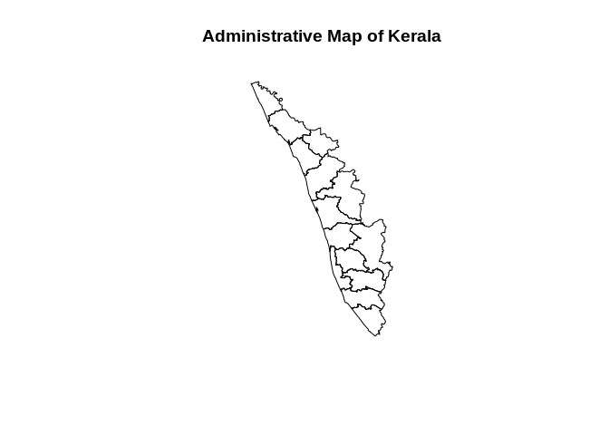
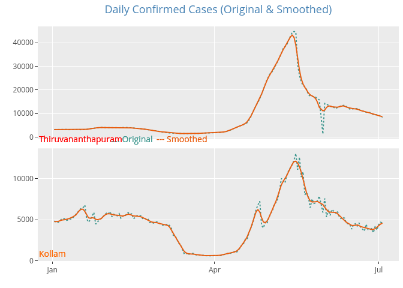
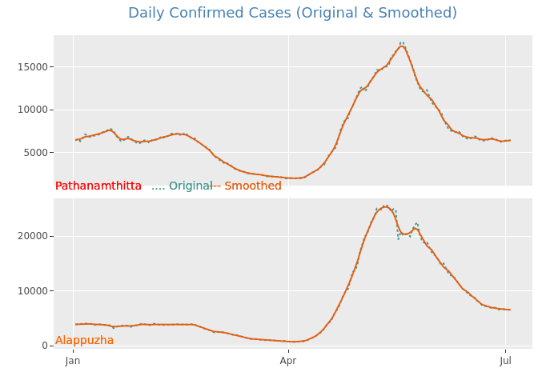
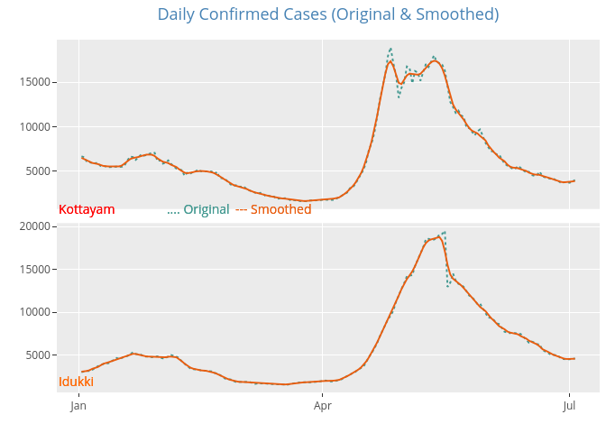
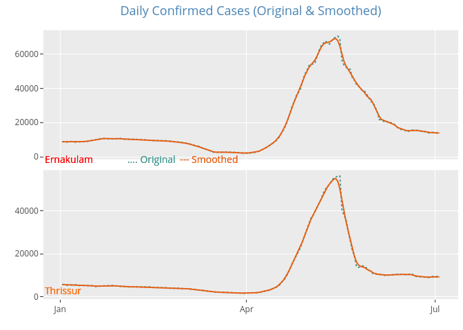
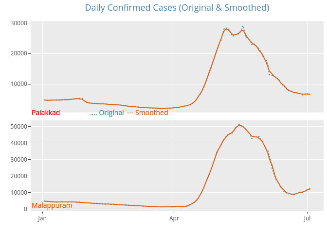
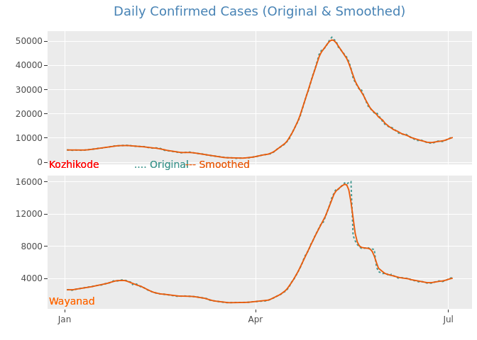
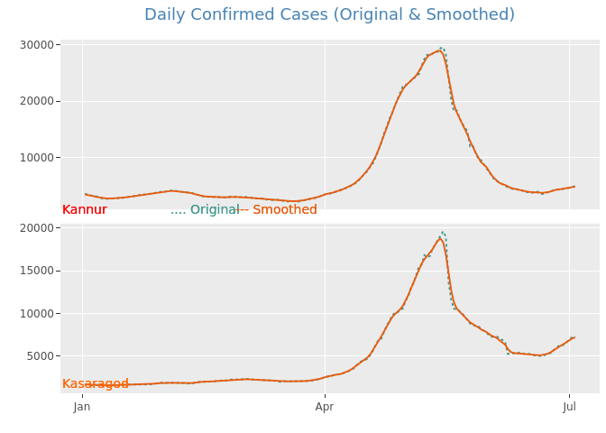
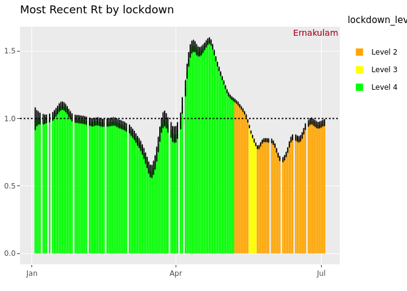

Kerala CoronaSafe Analytics
================

## Kerala Covid Analytics

In this document, we present the Covid 19 analysis in the state of
Kerala, India. The data is collected across the 14 districts and the
reproduction rate and growth rate of the epidemic have calculated for
the state of Kerala.

## Kerala State Map

<!-- -->

## Reproduction Rate Rt plots

### Covid Cases Trend per District:

<!-- --><!-- --><!-- --><!-- --><!-- --><!-- --><!-- -->

### Covid Rt Trend In Ernakulam:

<!-- -->

### Covid Growth Trend In Ernakulam:

<!-- -->
